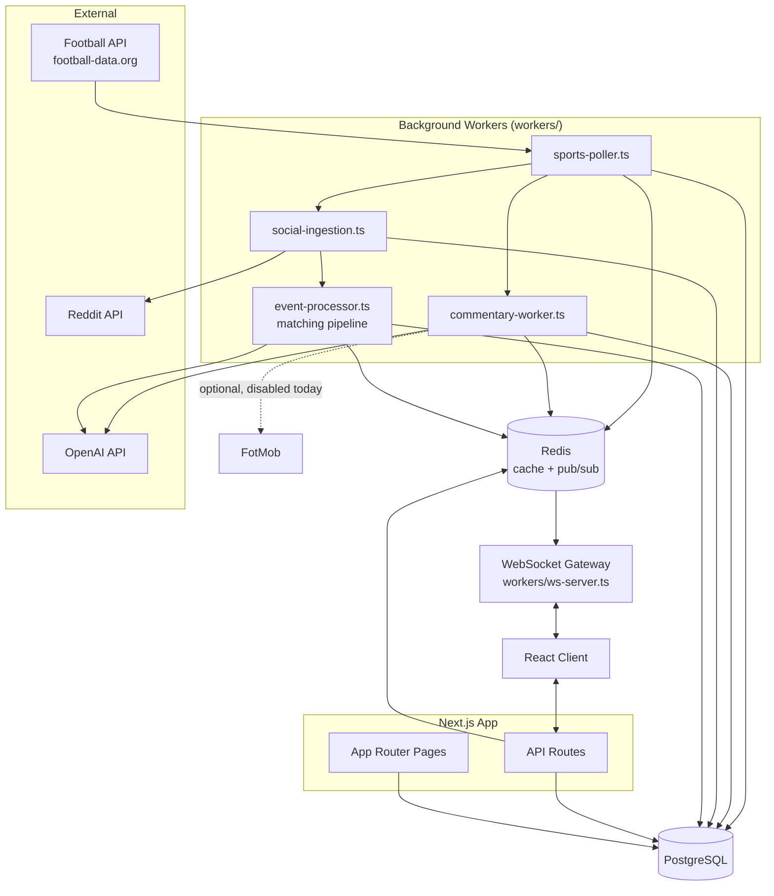
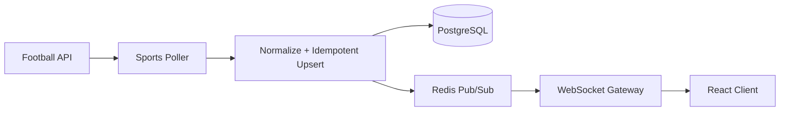
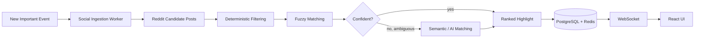
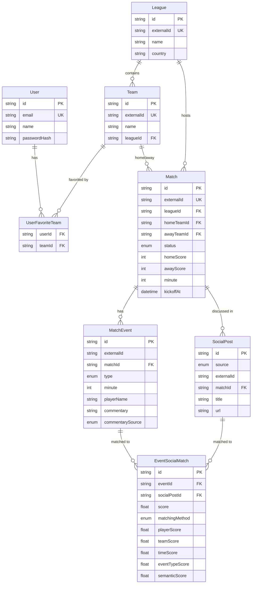
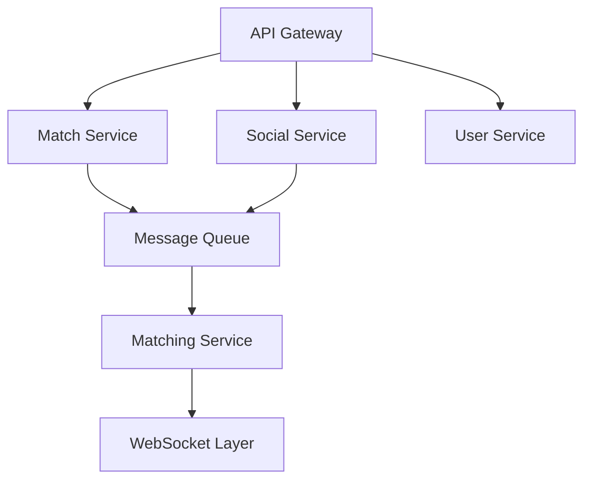

# MatchPulse

**A real-time football social-intelligence platform.** MatchPulse connects live match events with plain-English commentary and community reactions, so a fan watching a goal go in doesn't have to tab-switch between a score app, X, Reddit, and YouTube to understand what happened and what people think about it.

> Something happens → explain what happened → show the reaction → point to the clip. All in one feed, updating live, no refresh.

Built as a one-week, single-developer portfolio project demonstrating full-stack architecture: relational modeling, async workers, Redis pub/sub, WebSockets, an AI-assisted matching pipeline with cost controls, authentication, and a demo mode that works with zero external API keys.

---

## Overview

Fans can browse today's matches, open a live match page, and watch the event timeline update in real time: a goal appears immediately, a one-line description follows a beat later, and — if the community has reacted — a ranked Reddit highlight arrives after that. Users can create an account, follow teams, and get a personalized "Live For You" feed on their dashboard.

The core technical idea is a **progressive pipeline**: nothing waits on anything slower than it has to.

```
Goal detected → score/event appears immediately → commentary appears → community reaction appears
```

---

## Demo

Everything below works **without any external API keys** — the whole product is reproducible locally with seeded data and a pipeline-accurate event simulator (see [Demo Mode](#demo-mode)).

```bash
docker compose up -d
npm install
npm run db:migrate
npm run seed
npm run dev
npm run ws-server      # separate terminal — the WebSocket gateway
npm run simulate-event # separate terminal — fires a live goal through the real pipeline
```

Open `http://localhost:3000`, sign in with the seeded demo account (`demo@example.com` / `password123`), and open the Arsenal vs Chelsea match. Run `npm run simulate-event` again and watch the timeline update with no refresh.

---

## Architecture

A modular monolith, not microservices — see [Why not microservices?](#why-not-microservices) below. One Next.js app for the UI and API routes, a small set of background workers for ingestion/matching, Postgres for durable state, and Redis for caching + pub/sub fan-out to a standalone WebSocket gateway.



### Why not microservices?

Every "service" above (poller, commentary, social ingestion, matching, WS gateway) is a plain TypeScript module with a narrow interface, running in-process or as a lightweight standalone script against the same Postgres/Redis. That gets ~90% of the architectural benefit of service separation — clear ownership, independent testability, swappable providers — without the operational cost of network boundaries, service discovery, or distributed tracing for a project this size. See [Future Improvements](#future-improvements) for how this would actually decompose at real scale.

---

## Data Flow

**Sports data → UI:**



**Match event → community highlight:**



---

## Database



**Notable design decisions:**

- `MatchEvent` has `@@unique([matchId, externalId])`, not a global unique on `externalId` alone — provider event IDs are only guaranteed unique within a match, and this is also the idempotency backstop (see [Reliability](#reliability)).
- `UserFavoriteTeam` uses a **composite primary key** `@@id([userId, teamId])` — it's the relationship itself, so a synthetic id column would be pure overhead, and the composite key already enforces "a user can't favorite the same team twice" for free.
- `EventSocialMatch` stores every component score (`playerScore`, `teamScore`, `timeScore`, `eventTypeScore`, `semanticScore`), not just the final blended score — the whole point of the matching design is that it's explainable, not a black box (see [AI Matching](#ai-matching)).
- `SocialPost` has `@@unique([source, externalId])` so the same Reddit post found by two overlapping searches is never stored twice.

---

## Real-Time Architecture

**Redis** does three jobs, each with a deliberately short TTL (see `lib/redis/keys.ts` for the full table and reasoning):

1. **Caching** — `sports:matches:{date}`, `sports:match:{id}`, etc. TTLs of 10–30s. Live data goes stale fast, so these are short-lived speedups, not a source of truth.
2. **Pub/Sub** — one channel, `football:updates`, carrying a discriminated union (`match_event | commentary_update | highlight_update | match_update`). A single channel was chosen over one-per-message-type because the WebSocket gateway subscribes once and fans out based on `matchId`/`teamIds` per connection — there's no meaningful throughput problem at this scale, and one stream is simpler to reason about.
3. **Dedup/in-flight markers** — `dedupe:event:*`, `dedupe:social:*`, `dedupe:matching:*`. These are a fast-path optimization layered on top of Postgres unique constraints, not the source of truth for correctness (see [Reliability](#reliability)).

**WebSockets** run as a standalone gateway process (`workers/ws-server.ts`) rather than inside the Next.js request cycle, because a long-lived socket server and a stateless HTTP framework want different lifecycles. The gateway:

- Subscribes to `football:updates` on one dedicated Redis connection.
- Keeps an in-memory map of connected clients → `{ matchIds, favoriteTeamIds }` (this is a single process, so "do not over-engineer" wins over a Redis-backed subscriber registry — see [Future Improvements](#future-improvements) for what changes at scale).
- Authenticates a connection via a short-lived JWT minted by `POST /api/ws-token` from the user's real NextAuth session — the gateway runs on its own port outside Next's request pipeline, so it can't read the session cookie directly, and this is the trusted bridge.
- Handles malformed frames, disconnects, and reconnects: the client (`lib/websocket/use-realtime.ts`) reconnects with exponential backoff and re-sends its subscriptions on every reconnect, since the gateway keeps no session state across connections.

**Progressive updates** are the product's core UX idea, not just a technical detail: `lib/sports/ingest.ts` persists a new event and publishes `match_event` *before* kicking off commentary retrieval or social search — those run as tracked fire-and-forget work and publish their own `commentary_update` / `highlight_update` messages when they finish. The UI never blocks the scoreboard on a Reddit search.

---

## Commentary Architecture

Commentary is retrieved through a **provider chain** (`lib/commentary/`), each with a single interface:

```ts
interface CommentaryProvider {
  name: string;
  getCommentary(input: CommentaryInput): Promise<Commentary | null>;
}
```

Fallback order: **sports-api detail** → **FotMob (disabled)** → **LLM** → **generated template**. Every provider is timeout-wrapped and failure-isolated — one slow/broken provider is logged and skipped, never fatal.

### FotMob investigation

The brief asked me to check whether FotMob exposes structured commentary I could legitimately use. FotMob's site is backed by an internal JSON API its own frontend calls — undocumented, no public developer program, no published terms permitting third-party use, and no stable versioning. Using it would mean depending on an endpoint that can change without notice and would likely require reverse-engineering request signing that drifts into "circumventing technical protections" — explicitly out of scope for this project. **Conclusion: not used.** `lib/commentary/fotmob.ts` keeps a real slot in the provider chain (so a legitimate, documented API could be dropped in later without touching anything else) but always returns `null` today. The app is fully functional without it.

### LLM commentary

`lib/commentary/llm-provider.ts` writes one original, vivid sentence per event (goals, cards, substitutions, VAR) using **gpt-4o-mini** — chosen for being the cheap, already-integrated model (same `OPENAI_API_KEY` / `openai` package as the AI matching provider below; ~$0.0001/event, so backfilling the whole season's worth of events cost a few cents). Skipped instantly with no network call if `OPENAI_API_KEY` is unset, exactly like the AI matching provider.

The same line drawn for FotMob applies here: ESPN's own play-by-play sentence (`MatchEvent.sourceText`, captured from `keyEvents[].text` in the free `site.api.espn.com` summary already fetched for goals/cards/subs) is passed to the model **as facts to extract, not text to paraphrase** — shot type, placement, assist type, foul severity. The prompt explicitly forbids copying its wording, and the few-shot examples that calibrate the model's voice were written fresh for this project, not lifted from any broadcast or article. Backfilled via `npm run regenerate-commentary` (re-runs the whole existing event history through the new chain; safe to re-run).

### Generated fallback

When no external commentary exists — or `OPENAI_API_KEY` is unset, or the LLM call times out/errors — `lib/commentary/generated.ts` produces a deterministic, template-based sentence from structured event data, no network call. This is the guaranteed floor for the whole chain, exercised live every time the demo runs without an OpenAI key configured.

---

## AI Matching

**Why AI is needed at all:** Reddit post titles are noisy and inconsistent ("`[Goal] Saka cuts inside and curls it past the keeper! 67'`" vs "Saka with an absolute screamer 😭"). Exact-match or simple keyword search misses too much; sending every candidate post to an LLM is slow and expensive. The pipeline (`lib/matching/`) runs three stages, each narrowing the problem before the next:

1. **Deterministic filtering** (`deterministic.ts`) — cheap, no scoring: does the post mention either team (or a known alias/nickname) or the player, and was it posted in a plausible time window around the event? This alone eliminates the vast majority of irrelevant candidates before any similarity math runs.
2. **Fuzzy matching** (`fuzzy.ts`) — token-overlap and edit-distance scoring across four components: player name (tolerates "B. Saka" / "Saka" / a typo), team (tolerates nicknames via `team-aliases.ts`), event-time proximity (a post referencing `66'` scores close to a `67'` event), and event-type keywords.
3. **Semantic/AI matching** (`ai-provider.ts` + `openai-provider.ts`) — **only for genuinely ambiguous candidates**: fuzzy score in a mid-confidence band, capped at 5 AI calls per event. A confident fuzzy match (≥ 0.72) skips the AI entirely; anything below the relevance floor (0.35) is dropped before it ever reaches scoring.

**Scoring is transparent, not a black box** — every result stores its component scores:

```
player similarity     30%
team similarity        25%
time proximity         20%
event-type match       10%
semantic similarity    15%   (renormalized out of the total when AI wasn't used)
```

**AI cost control, concretely:** for the seeded Arsenal–Chelsea goal (4 candidate posts, 1 deliberately irrelevant), the pipeline narrows to 3 after deterministic filtering and calls the AI provider **zero times** — every surviving candidate is confidently resolved by fuzzy matching alone (see `matching_completed` in the logs, or `tests/unit/matching-pipeline.test.ts` for the same behavior asserted directly with a stub provider that throws if called for a non-ambiguous candidate).

**Graceful degradation:** if `OPENAI_API_KEY` is unset, or the API times out or errors, `matchEventToPosts` falls back to fuzzy-only scoring and keeps working — this is exercised live every time the demo runs (no API key is configured in this repo's `.env.example` by default) and covered by `tests/unit/matching-pipeline.test.ts`.

---

## Reddit-Sourced Live Detection (v1)

`workers/sports-poller.ts` needs an official sports data API to know when something happened. A live-scores tier of one exists (see [Local Setup](#local-setup)), but it costs money and isn't a hard requirement to demonstrate the real-time architecture — so `workers/reddit-live-poller.ts` is an alternative source for v1: it treats **Reddit itself** as the live-event feed, on the premise that r/soccer's community usually posts a goal clip within seconds of it happening, often faster than a delayed API would confirm it anyway.

**How it works:** every 20s, for each match that's `LIVE` or `SCHEDULED` with kickoff already passed, it searches r/soccer and feeds anything it finds through the exact same `ingestNormalizedEvent` pipeline every other source uses — same idempotency, same Redis publish, same WebSocket fan-out. The triggering post is attached as the event's highlight immediately (score 1.0, method `DETERMINISTIC`) instead of going through a separate post-hoc search, since it *is* the source, not something found afterward.

**Confidence is not uniform across event types — this is the tradeoff to know before trusting this in front of anyone:**

| Event | Detection | Confidence | Why |
|---|---|---|---|
| Goals | r/soccer's dedicated **"Goal Clip"** flair (`flair_name:":n_goal: Goal Clip"`), with a lenient-flair then keyword fallback if that returns nothing | High | A purpose-built signal — someone using this flair is asserting "this is a goal," not just discussing the match. Comes with an instant embeddable clip. |
| Red cards | Keyword search only (`"<team> <team> red card"`) | Lower | No dedicated flair exists for these. Can miss one, or occasionally match a post about a red card from an unrelated match involving the same team. |
| Yellow cards, substitutions | **Not detected** | — | There's no "someone always posts this" signal on Reddit the way there is for goals. Closing this gap needs an official data source (`workers/sports-poller.ts`), free or paid. Demonstrate them manually with `npm run simulate-event -- --type=yellow` / `--type=sub`. |

**Goal parsing targets r/soccer's actual "Goal Clip" title convention**, confirmed against real examples rather than guessed:

```
Lille 2-[2] Paris Saint-Germain - Marquinhos 90+5'
Crystal Palace 1 - [4] Manchester City - Erling Haaland 84'
Bayern [5] - 1 Stuttgart - Luis Diaz 93' (Amazing pass from Saibari)
```

The scoring team's number is wrapped in **`[brackets]`** — an explicit, unambiguous "who scored" signal, which `parseGoalClipTitle()` reads directly rather than inferring. From the same match it also pulls minute (including stoppage time, `90+5`), player name, and a `Penalty` flag (→ event type `PENALTY_GOAL` instead of `GOAL`). All three examples above, plus a fourth with no brackets at all, are asserted verbatim in `tests/unit/reddit-goal-clip-parser.test.ts`.

Not every post follows the convention exactly (that fourth example — `Tijuana 2-0 Pumas - Gilberto Mora Penalty 81'` — has no brackets), so `resolveGoalEvent()` falls back to the older heuristic for anything the structured parser can't confidently read: alias matching first, then the same score-delta idea as the fallback in `workers/sports-poller.ts` (parse an "X-Y" score, compare it to the match's currently known score, see which side went up). **If neither strategy resolves a scoring side, the post is skipped** — an auto-detected goal wrongly credited to the wrong team would also mis-increment the scoreboard, which is worse than not showing it at all. Red cards, which have no equivalent bracket convention, always use this fallback path.

**Because there's no official status/score feed**, this worker also heuristically flips a match `SCHEDULED → LIVE` at kickoff time and `LIVE → FINISHED` after an assumed ~125-minute duration, and refreshes `minute` from elapsed time each cycle (on top of the client-side ticking in [Real-Time Architecture](#real-time-architecture)).

**What's verified vs. what isn't:** the title parser is tested against real post titles (above), and the full pipeline it feeds into — event ingestion, score increment, highlight attach, idempotency, ambiguous-team skip — is verified against real Postgres/Redis with the Reddit network call mocked (`tests/integration/reddit-live-poller.test.ts`). The flair string (`GOAL_CLIP_FLAIR` in `lib/reddit/live-detector.ts`) **was** confirmed against a live r/soccer search on 2026-09-02: the indexed flair name carries the `:n_goal:` emoji shortcode, so `flair_name:"Goal Clip"` returns nothing while `flair_name:":n_goal: Goal Clip"` returns real goal-clip posts — the constant and its fixtures in `tests/unit/reddit-goal-clip-parser.test.ts` were updated from that scrape. What's still *not* exercised in CI is the search round-trip itself (the OAuth call is mocked in tests); if moderators rename the flair, `findGoalClipPosts()` degrades through its lenient-flair and keyword fallbacks at lower precision.

To run it: `npm run worker:reddit-live-poller` (requires `REDDIT_CLIENT_ID`/`REDDIT_CLIENT_SECRET` — see [Environment Variables](#environment-variables); without them it logs a warning and does nothing, same graceful-skip behavior as every other optional provider in this app).

---

## Reliability

**Idempotency** is enforced at three layers, from fastest/weakest to slowest/authoritative:

1. A Redis `SET NX` marker (`dedupeKeys.eventSeen`, `lib/redis/cache.ts#claimOnce`) short-circuits the common case of a slow overlapping poll cycle re-processing the same event.
2. If Redis and Postgres ever disagree (TTL expiry, Redis restart), the code falls through to an actual `create()` attempt.
3. Postgres's `@@unique([matchId, externalId])` constraint is the real source of truth — a `P2002` violation on insert is caught and treated as "already exists," not an error. `lib/sports/ingest.ts#ingestNormalizedEvent` is safe to call an unbounded number of times with the same input.

This is proven, not just asserted: `npm run simulate-event -- --replay` re-sends the exact same event through the real pipeline and reports whether a duplicate was created (it isn't), and `tests/integration/event-ingestion.test.ts` asserts the same against a live Postgres instance.

**Failure isolation:**

- **Sports API down:** `lib/sports/football-data.ts` times out, retries 3× with exponential backoff, and returns `[]`/`null` on final failure — logged as `sports_api_failure`, never thrown into the poll loop. One bad match in a poll cycle (`workers/sports-poller.ts`) doesn't stop the rest from processing.
- **Reddit down/unconfigured:** `lib/reddit/client.ts#searchSubreddit` returns `[]` on any failure. Social ingestion simply finds no new candidates; existing highlights stay visible.
- **AI provider down/unconfigured:** see [AI Matching](#ai-matching) — silent fallback to fuzzy-only scoring.
- **WebSocket disconnects:** client reconnects with exponential backoff (capped at 15s) and re-subscribes; the gateway itself is stateless per-connection, so a reconnect is just a fresh subscribe.
- **A background trigger outliving its caller:** short-lived scripts (`seed.ts`, `simulate-event.ts`) fire commentary/social work without awaiting it inline (so the *interactive* pipeline stays non-blocking) but track those promises via `waitForPendingBackgroundWork()` and wait for them before disconnecting Prisma/Redis — otherwise the process could exit mid-query. This is a real bug I hit and fixed while building this: the first version disconnected immediately and the in-flight commentary query died with an opaque Prisma engine error.

**Caching** avoids redundant calls to the sports API within its refresh window — see the TTL table in `lib/redis/keys.ts`.

---

## Security

- **Authentication:** Auth.js (NextAuth v5) with the **Credentials provider + JWT sessions** — no OAuth provider, so no database adapter/Account/Session tables, which would be pure overhead here. Passwords are hashed with bcrypt (`bcryptjs`, cost factor 10) and never logged (`lib/logger` redacts known-sensitive keys).
- **Authorization:** every user-scoped API route reads the user id from the server-verified session (`auth()`), never from the client. `DELETE /api/user/favorite-teams/:teamId` is structurally incapable of touching another user's row — the query is always scoped to `session.user.id`, proven in `tests/api/favorite-teams.test.ts`.
- **Route protection:** `proxy.ts` (Next.js's renamed middleware convention) redirects unauthenticated requests to `/dashboard/*` to `/login`.
- **API keys never reach the browser:** `OPENAI_API_KEY`, `SPORTS_API_KEY`, `REDDIT_CLIENT_SECRET` are read only in server-side modules (`lib/*`, `workers/*`) and are not `NEXT_PUBLIC_*` variables.
- **WebSocket auth:** the gateway verifies a short-lived (60s) signed JWT before honoring a `subscribe_favorites` request; unauthenticated connections can still subscribe to a specific `matchId` (that's public data) but not to a favorites feed.
- **Input validation:** every API route that accepts a body or query parameter validates it with `zod` and returns `400` on failure, rather than letting bad input reach Prisma.
- **Rendering untrusted content:** Reddit titles/bodies are rendered as plain React text (never `dangerouslySetInnerHTML`), and commentary text is HTML-stripped in `lib/commentary/normalizer.ts` before storage.
- **Rate limiting:** both the sports API client and the Reddit client enforce a conservative request budget via Redis counters (`lib/sports/football-data.ts`, `lib/reddit/client.ts`), independent of the providers' own limits.

---

## Testing

55 tests across three layers — prioritizing core business logic over coverage percentage, per the project brief:

- **Unit** (`tests/unit/`) — pure functions with no I/O: provider-response normalization, commentary generation/normalization, text/fuzzy-matching utilities, weighted scoring, and the full 3-stage matching pipeline exercised with a stub AI provider (including a test that asserts the AI provider is *never called* for a confident fuzzy match, and that a *failing* AI provider doesn't break matching).
- **Integration** (`tests/integration/`) — against the real local Postgres/Redis: event-ingestion idempotency (processing the same external event twice yields exactly one row), Redis dedup/cache helpers.
- **API** (`tests/api/`) — Next.js route handlers invoked directly with real `Request` objects and a mocked session: unauthenticated access is rejected, invalid input is rejected, and — the one I consider most important — a user can never delete another user's favorite team, proven against real Postgres rows for two distinct users.

```bash
npm test
```

---

## Local Setup

```bash
docker compose up -d      # Postgres + Redis
npm install
npm run db:migrate        # create schema
npm run seed               # realistic demo data: teams, matches, events, commentary, Reddit-style posts, real matching results
npm run dev                 # Next.js app  — http://localhost:3000
npm run ws-server           # WebSocket gateway (separate terminal) — ws://localhost:4001
```

Optional, for a live (non-demo) match feed — two independent sources, see [Reddit-Sourced Live
Detection](#reddit-sourced-live-detection-v1) for the tradeoffs between them:

```bash
npm run worker:reddit-live-poller   # requires REDDIT_CLIENT_ID/REDDIT_CLIENT_SECRET — v1 default, free
npm run worker:sports-poller        # requires SPORTS_API_KEY — official data, but see note below
```

> **football-data.org pricing, confirmed against their current pages (not assumed):** the free
> tier returns **delayed** scores, not live — real-time/in-play data needs their "Free w/
> Livescores" tier, €12/month (not the €29 ML/Deep-Data tiers, which bundle extras this app
> doesn't use). Free-tier competition coverage lists Premier League, Bundesliga, and La Liga
> among others — confirm on your own account after registering, since this page showed some
> inconsistency between its marketing copy and pricing table when checked. Neither of this
> blocks the demo experience above, which never depends on a live key — see [Demo
> Mode](#demo-mode).

Other commands:

```bash
npm run simulate-event                                    # fire a new goal through the real pipeline
npm run simulate-event -- --type=red                      # or: yellow, var, sub
npm run simulate-event -- --match=<matchExternalId>        # target any seeded match, not just the default
npm run simulate-event -- --replay     # re-send the last event — proves idempotency
npm test                                # unit + integration + API tests
npm run db:studio                       # Prisma Studio, browse the DB
```

> This repo's dev environment doesn't have Docker available, so Postgres/Redis were run via Homebrew (`brew install postgresql@16 redis`) during development instead — `docker compose up -d` is the intended path and works identically.

## Environment Variables

See `.env.example` for the full list with inline documentation. Nothing beyond `DATABASE_URL`, `REDIS_URL`, and `AUTH_SECRET` is required to run the full demo experience — `SPORTS_API_KEY`, `OPENAI_API_KEY`, and `REDDIT_CLIENT_ID`/`REDDIT_CLIENT_SECRET` are all optional, with documented graceful fallback when unset (see [Reliability](#reliability)).

## Demo Mode

The entire core experience — goal → commentary → community highlight → live UI update — is reproducible without waiting for an actual football match or holding any external API key:

- `npm run seed` builds realistic demo data by calling the **real ingestion pipeline** (`lib/sports/ingest.ts`), not by writing rows that bypass it — every seeded event gets real generated commentary, and the marquee goal is matched against seeded Reddit-style posts by the real matching engine, with real (not hand-authored) transparent scores.
- `npm run simulate-event` drives a brand-new event through that same pipeline: `Simulator → ingestNormalizedEvent → PostgreSQL → Redis → WebSocket → Browser` — never `Simulator → hardcoded React state`. Open a match page, run the simulator, and watch it update with no refresh.

---

## Future Improvements

Explicitly **not** built, and why that's the right call for this scope — not a shortcut:

- **Durable queues** (e.g. a real job queue instead of fire-and-forget-with-tracking) — worth it once retries-with-backoff need to survive a process restart, not before.
- **Horizontal scaling of the WS gateway** — today's in-memory subscriber map works because it's one process. At real scale this becomes: Redis-backed subscriber registry (`team:{id}:subscribers` sets, as sketched in the original brief) + multiple gateway instances behind a sticky-session load balancer.
- **Push notifications** for events on followed teams while the app is closed.
- **Additional sports/leagues** — the schema and provider abstractions don't assume football specifically anywhere except the UI copy.
- **Improved ranking** — a learned re-ranker over the same component scores, once there's enough labeled match/no-match data to train on.
- **A first-party community layer** — the `SocialProvider` abstraction exists specifically so this doesn't require ripping out Reddit, just adding a provider.
- **Licensed media embeds** — today the app only ever links to Reddit/source content, deliberately never re-hosts footage.
- **Native mobile app** — the API layer is already a clean boundary a mobile client could consume directly.

At real scale, this modular monolith is structured to decompose roughly like:



Every box on the right already exists as a distinct module today (`lib/sports`, `lib/reddit`+`lib/social`, `lib/matching`, `lib/websocket`) — splitting them into services later is a deployment change, not a rewrite.

---

## Repository Structure

```
app/           Next.js App Router — pages + API routes
components/    React components (match, feed, teams, commentary, social, auth, ui)
lib/           Provider-agnostic business logic — db, redis, auth, sports, reddit, social,
               commentary, matching, websocket, http, logger
workers/       Standalone/background processes — sports-poller, commentary-worker,
               social-ingestion, event-processor, ws-server
prisma/        Schema + migrations
scripts/       seed.ts, simulate-event.ts
tests/         unit/, integration/, api/
```
